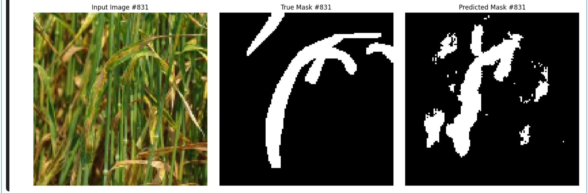
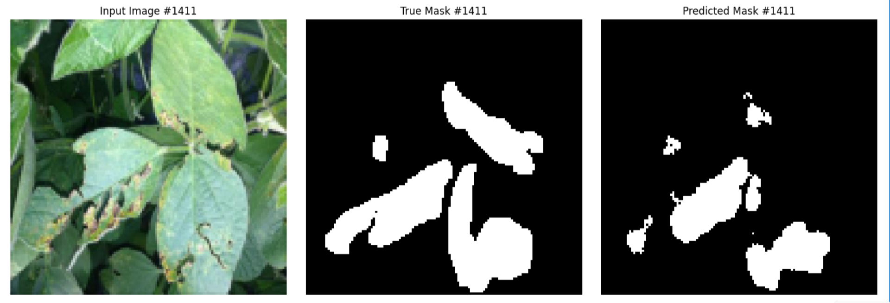

# 🌿 U-Net-Based Plant Leaf Segmentation

This deep learning project leverages a U-Net architecture, built on Convolutional Neural Networks (CNNs), to perform **semantic segmentation** on plant leaf images. The model is trained to detect and segment disease-affected areas in leaves using binary masks, enabling pixel-level plant disease localization.

---

## 🧠 Project Overview

- ✅ Image segmentation using **U-Net**
- ✅ Preprocessing of annotated leaf datasets
- ✅ Binary mask prediction for infected vs. healthy regions
- ✅ Evaluation using **IoU** and **Dice Coefficient**
- ✅ Visual validation on test and demo samples

---

## ⚙️ Technologies Used

- Python, TensorFlow/Keras
- NumPy, OpenCV, PIL, Matplotlib
- scikit-learn
- U-Net (custom architecture)

---

## 🖼 Sample Predictions

Each row below shows:
- Input leaf image  
- Ground truth segmentation mask  
- Predicted segmentation mask by the model

### 🟢 Example 1  


---

### 🟢 Example 2  


---

### 🟢 Example 3  


---

## 📊 Performance Metrics

- **Pixel Accuracy:** ~84%
- **Mean IoU:** 0.80
- **Mean Dice Coefficient:** 0.89

---

## 📂 Project Structure

- `cnn_unet_leaf_segmentation.ipynb` – Full notebook with training, evaluation, and prediction
- `plantseg/` – ⚠️ Not included due to size. [Download from Kaggle](https://www.kaggle.com/datasets/weitianqi/plantseg)
- `Demo Images` - Images used for demonstration
- `images/` – Folder containing sample visualizations
- `README.md` – This project overview

---

## 🌱 Dataset

The model is trained on the publicly available **PlantSeg** dataset from Kaggle, which contains annotated plant leaf images and corresponding segmentation masks.

📦 **Download here:**  
[🔗 PlantSeg Dataset on Kaggle](https://www.kaggle.com/datasets/weitianqi/plantseg)

> ⚠️ Note: Due to its large size, the dataset is not included in this repository. After downloading, extract it into a folder named `plantseg1/` and update the path in the notebook accordingly.

---

## 🚀 How to Run

1. Clone the repo:
   ```bash
   git clone https://github.com/your-username/cnn-unet-plant-leaf-segmentation.git
   cd cnn-unet-plant-leaf-segmentation
